# React + Vite

This template provides a minimal setup to get React working in Vite with HMR and some ESLint rules.

Currently, two official plugins are available:

- [@vitejs/plugin-react](https://github.com/vitejs/vite-plugin-react/blob/main/packages/plugin-react/README.md) uses [Babel](https://babeljs.io/) for Fast Refresh
- [@vitejs/plugin-react-swc](https://github.com/vitejs/vite-plugin-react-swc) uses [SWC](https://swc.rs/) for Fast Refresh

## Expanding the ESLint configuration

If you are developing a production application, we recommend using TypeScript and enable type-aware lint rules. Check out the [TS template](https://github.com/vitejs/vite/tree/main/packages/create-vite/template-react-ts) to integrate TypeScript and [`typescript-eslint`](https://typescript-eslint.io) in your project.

# Backend Repository
🔗 **Link**: [https://github.com/Sunanda01/Cartzy_Server.git](https://github.com/Sunanda01/Cartzy_Server.git)

## Screen
- Login Page
- Register Page
- Admin Dashboard
- Checkout
- Order Details
- Error route -> Auto Redirect to Home Page

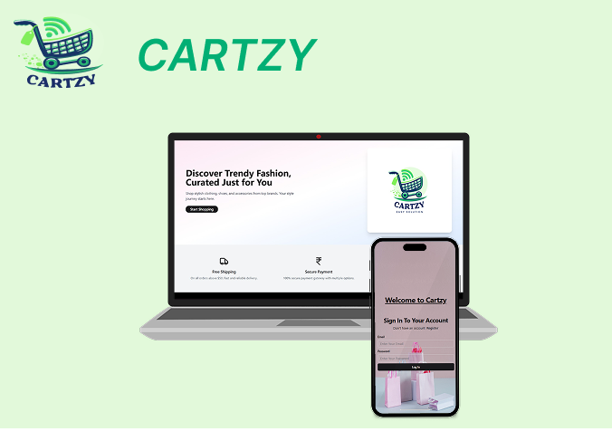

<br/>


## Quick Glimpses 
<table>
  <tr>
    <td>Register Page<br>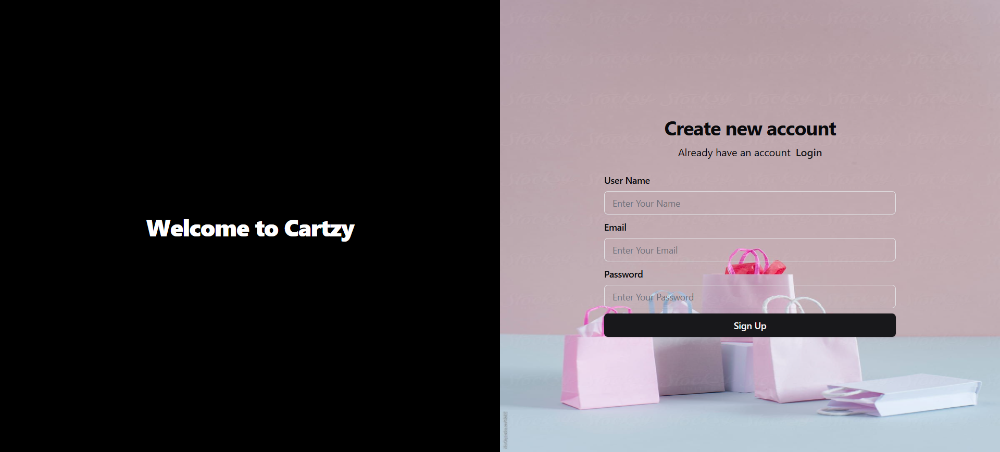</td>
     <td>Login Page<br>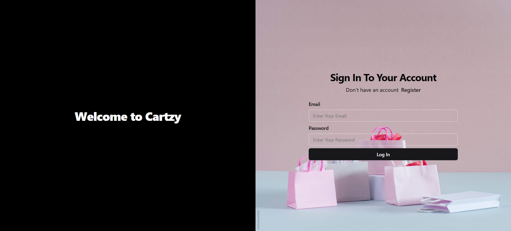</td>
    </tr>
   <tr>
    <td >Admin Dashboard<br/> 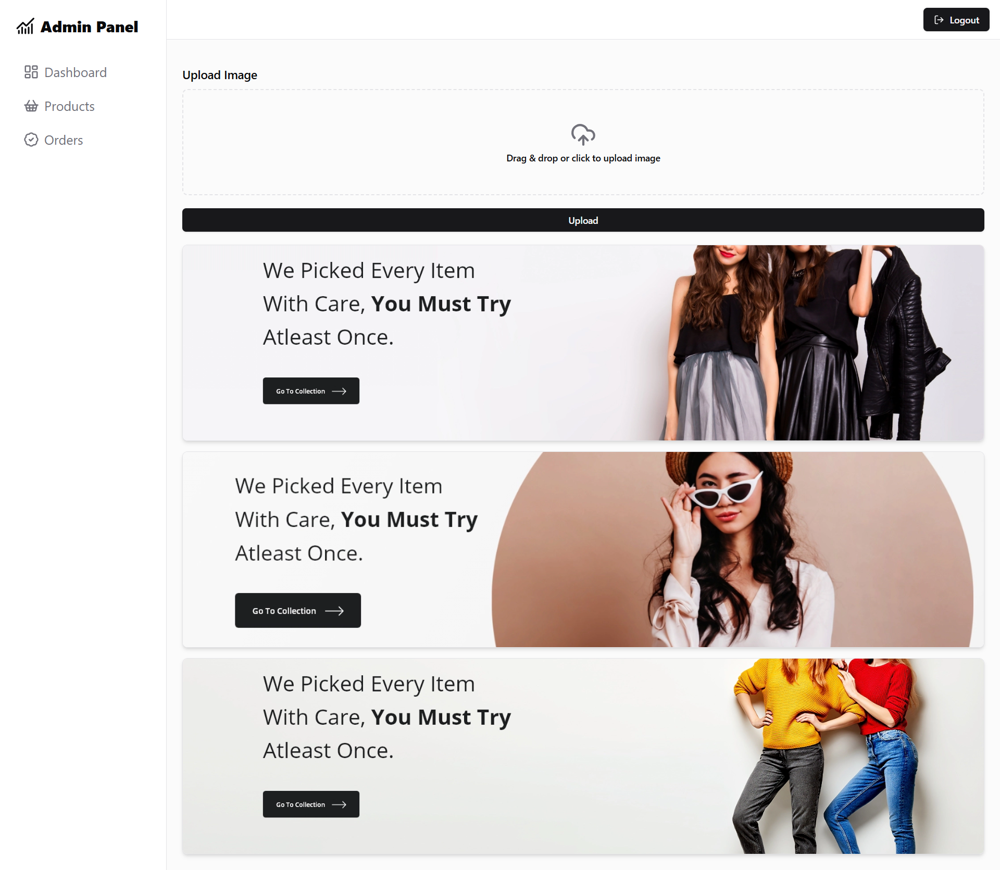</td>
      <td >Admin Order List<br/> 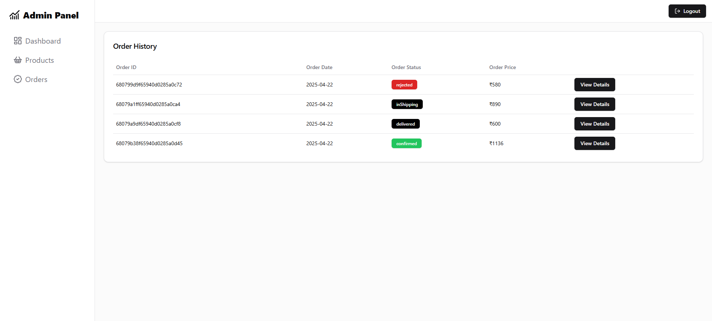</td>
  </tr>
   <tr>
    <td colspan="2">Admin Products<br/> </td>
  </tr>
   <tr>
    <td >Add Products<br/> 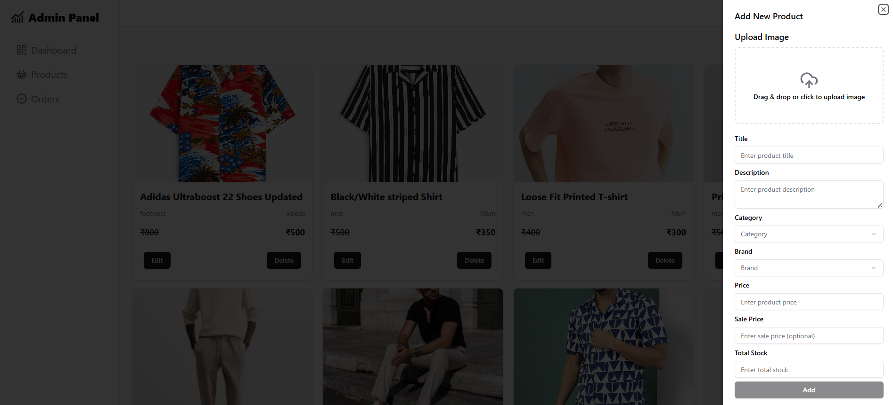</td>
     <td >Update Products<br/> 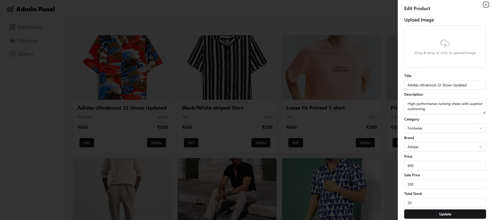</td>
  </tr>
  <tr>
    <td >Admin Order Details<br/> 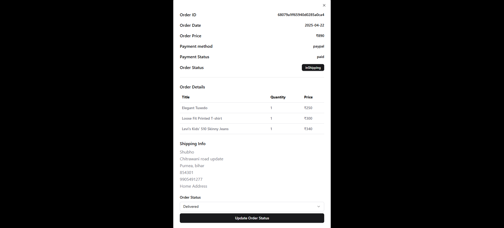</td>
    <td>Landing Page<br/> 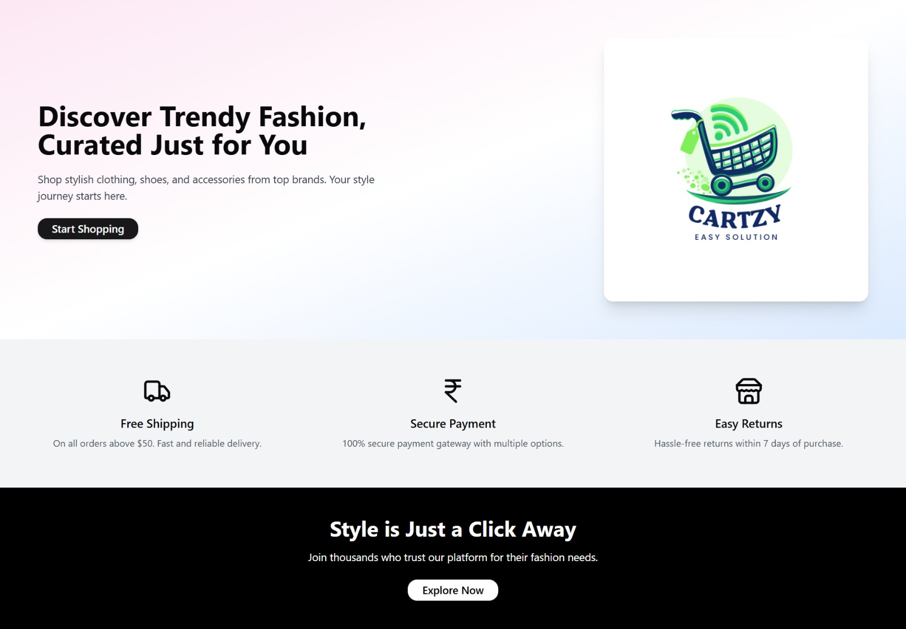</td>
  </tr>
   <tr>
    <td colspan="2">User Home Page<br/> </td>
  </tr>
    <tr>
    <td>Cart Page<br/> 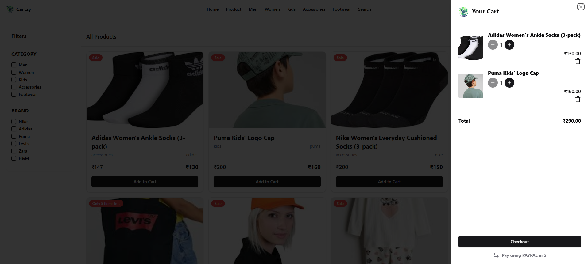</td>
      <td>Checkout Page<br/> 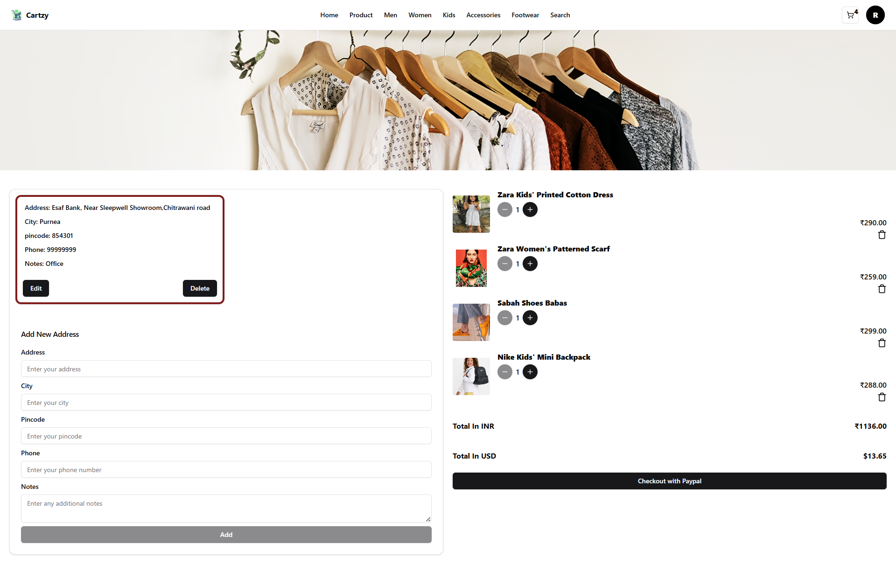</td>
  </tr>
   <tr>
    <td>Order History Page<br/> 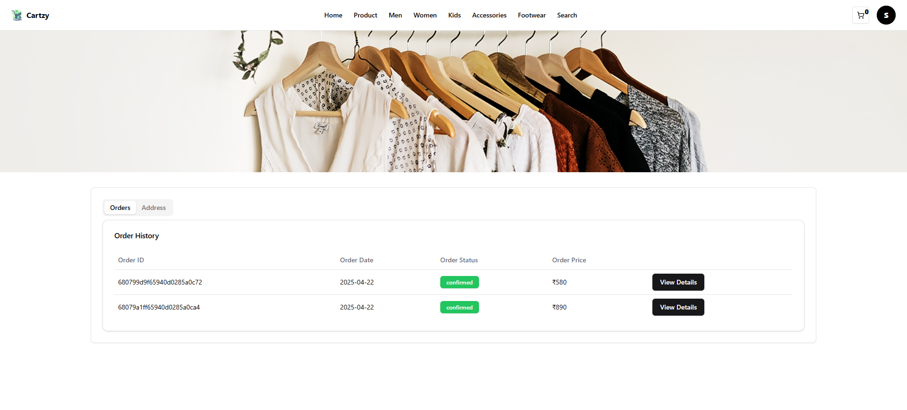</td>
      <td>Saved Address Page<br/> 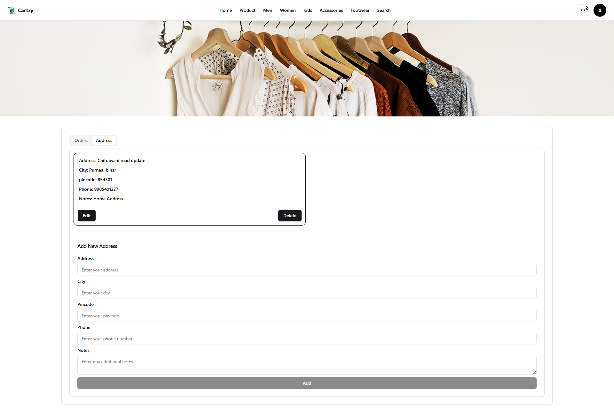</td>
  </tr>
  <tr>
    <td>Search Page<br/> 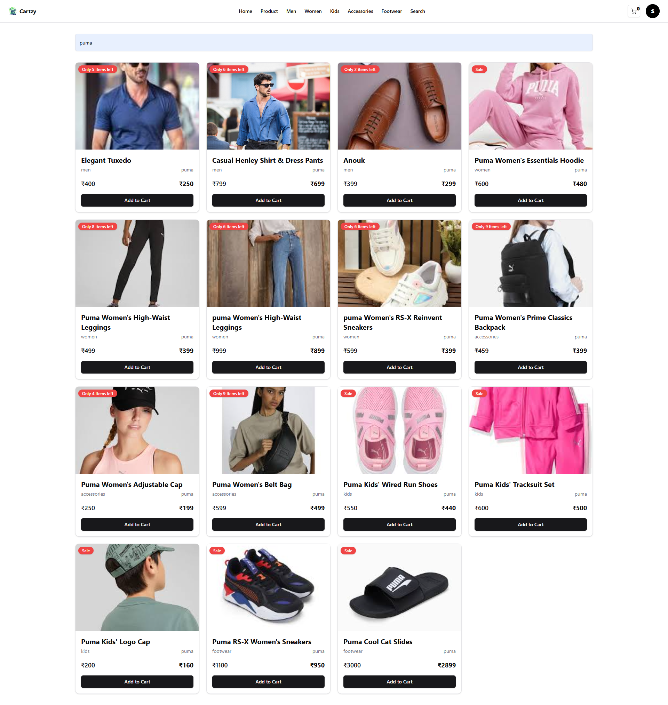</td>
  </tr>
</table>

## Get Started
Here I have actually kept the frontend of Cartzy web application.

## Clone the repo
First, clone the repo:
```bash
https://github.com/Sunanda01/Cartzy_Client.git
```

## Add .env files that is the secret of this project
```bash
Find .env file by searching import.meta.env as its a vite project
```

## For Dev Run
```bash
npm install
npm run dev
```
